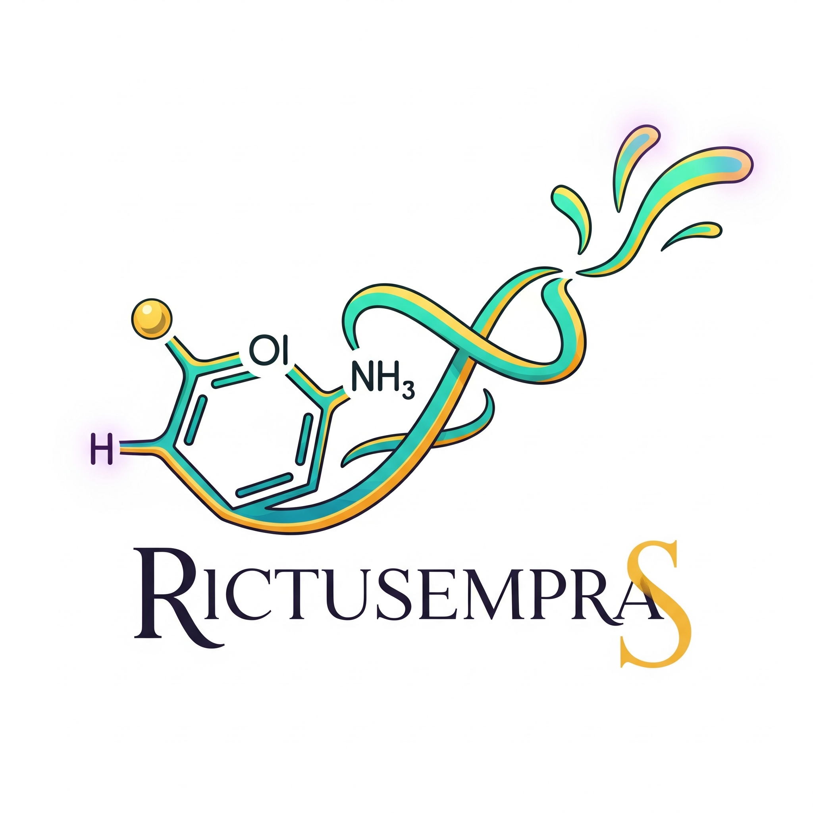

<div align="center">
  
</div>

# ***Rictusempra***: Interactive Molecule Protonation Tool 🧪

Rictusempra is a web-based cheminformatics tool for interactively visualizing small molecules and calculating their most likely protonation state at a given physiological pH. It provides a simple interface to generate 2D and 3D molecular structures and prepare them for further computational chemistry tasks like molecular docking or simulation.

<div align="center">
  
</div>

Developed by the [EvoMol-Lab](github.com/evomol-lab), [BioME](bioinfo.imd.ufrn.br), UFRN, Brazil.

---

## Core Features

- **SMILES Input**: Accepts a SMILES string to define the initial molecule.

- **2D & 3D Visualization**: Instantly renders 2D chemical diagrams (via RDKit) and interactive 3D structures (via Open Babel & streamlit-molstar).

- **Protonation State Calculation**: Uses **Dimorphite-DL** to calculate the dominant protonation state of the molecule within a user-defined pH range.

- **Side-by-Side Comparison**: Displays the initial and protonated structures next to each other for easy comparison.

- **Structure Download**: Allows users to download the generated 3D structures in `.mol2` format.

---

## Technology Stack

- **Frontend**: Streamlit

- **2D Structure Rendering**: RDKit

- **3D Structure Generation**: Open Babel

- **3D Structure Visualization**: streamlit-molstar

- **Protonation Calculation**: Dimorphite-DL

---

## Installation and Setup

It is **highly recommended** to use Conda for installation, as it handles the complex dependencies of RDKit and Open Babel smoothly.

### Step 1: Clone the Repository

```
git clone <your-repository-url>
cd <your-repository-folder>
```

### Step 2: Create Conda Environment

It's best practice to create a dedicated environment for the tool.

```
# Create and activate the conda environment
conda create -n rictusempra python=3.9
conda activate rictusempra

# Install packages from conda-forge
conda install -c conda-forge rdkit openbabel dimorphite-dl
```

### Step 3: Install Pip Dependencies

Install the remaining Python packages using pip.

```
pip install streamlit streamlit-molstar
```

---

## Usage

Once the environment is set up, you can run the Streamlit application from your terminal.

```
streamlit run rictusempra.py
```

A new tab will open in your web browser with the application running.

### How to Use the Tool:

1. **Enter SMILES**: In the sidebar on the left, enter the SMILES string of the molecule you want to analyze. The initial 2D and 3D structures will appear on the main panel.

2. **Set pH Range**: In the sidebar form, adjust the minimum and maximum pH values for the protonation calculation. The default is physiological pH (7.2-7.6).

3. **Calculate**: Click the "Calculate Protonation State" button.

4. **View & Download**: The results for the protonated molecule will appear below the initial structure. You can use the download buttons to save the `.mol2` files for either structure.

---

## Project File Structure

For the application to work correctly, your project folder should be organized as follows:

```
/your-project-folder
|-- rictusempra.py       # The main Streamlit app script
|-- rictusempra.png      # Your logo file
|-- requirements.txt   # Python dependencies for Streamlit Cloud
|-- packages.txt       # System dependencies for Streamlit Cloud
|-- README.md          # This documentation file
```

---

## Deployment on Streamlit Cloud

This tool is ready to be deployed on Streamlit Cloud. To ensure a successful deployment, you must include the following two files in your repository:

- **`requirements.txt`**: This file lists the Python packages.
  
  ```
  streamlit
  rdkit-pypi
  openbabel-wheel
  dimorphite-dl
  streamlit-molstar
  ```

- **`packages.txt`**: This file lists system-level dependencies required by RDKit.
  
  ```
  libxrender1
  ```

---

## References

If you use this tool in your research, please cite the underlying open-source packages that make it possible:

- **RDKit**:
  RDKit: Open-Source Cheminformatics Software. (n.d.). Retrieved August 24, 2025, from [http://www.rdkit.org](http://www.rdkit.org)

- **Open Babel**:
  O'Boyle, N. M., Banck, M., James, C. A., Morley, C., Vandermeersch, T., & Hutchison, G. R. (2011). Open Babel: An open chemical toolbox. *Journal of Cheminformatics*, *3*(1), 33. [Open Babel: An open chemical toolbox | Journal of Cheminformatics | Full Text](https://doi.org/10.1186/1758-2946-3-33)

- **Dimorphite-DL**:
  Ropp, P. J., Kaminsky, J. C., Yablonski, S., & Durrant, J. D. (2019). Dimorphite-DL: An open-source program for enumerating the ionization states of drug-like small molecules. *Journal of Cheminformatics*, *11*(1), 51. [https://doi.org/10.1186/s13321-019-0371-5](https://www.google.com/search?q=https://doi.org/10.1186/s13321-019-0371-5).

##  <a name='Disclaimer'></a>Disclaimer

The developer team used generative AI tools for the following tasks:

- Code revision and optimization.

- Elaborate documentation topic structure.

- Review english language.

----

<div align="center">
  
</div>